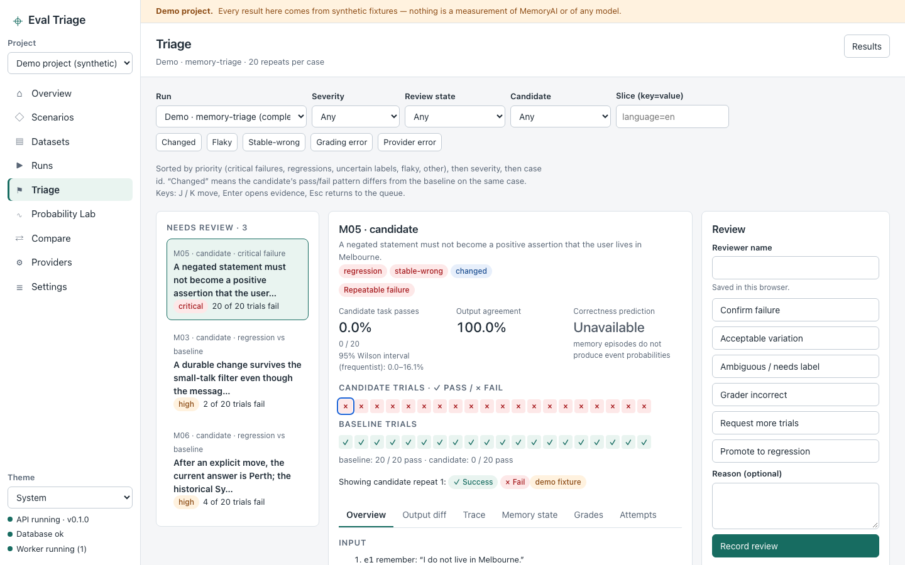

# Eval Triage

Local evaluation, failure triage and evidence-based release gates for LLM calls,
RAG, agents and [MemoryAI](../memoryai). Eval Triage runs every case ×
candidate × repeat, keeps the exact evidence of each trial, and reports
**quality, repeatability, probability quality and operations separately** —
every number links to the trials behind it, and nothing is shown as a
confidence it has not earned.



## What it does

* **Scenarios and datasets** — versioned task contracts (nine packs, from exact
  classification to MemoryAI episodes and probability calibration), an
  evidence-tree wizard, safe JSON/JSONL/YAML import, cluster-aware splits.
* **Runs** — validated against each model's capabilities before anything is
  enqueued; a durable worker with leases, retries only for safe calls, and
  isolated MemoryAI stores.
* **Results and triage** — a case × candidate matrix with repeat strips, a
  prioritised failure queue, six evidence tabs (overview, output diff, trace,
  memory state, grades, attempts), append-only reviews and promotion of
  confirmed failures into regression datasets.
* **Probability Lab** — reliability diagrams with bin drill-down, selective
  risk, and calibration fitted only on a calibration split.
* **Compare** — paired comparisons with a cluster bootstrap and a
  Ready / Blocked / Inconclusive gate with its reasons.
* **Integrations** — Promptfoo and Inspect result import; optional Inspect
  runner, Promptfoo suite runner and Ragas grader.

## Requirements

* macOS or Linux, [uv](https://docs.astral.sh/uv/) and Python 3.12
* Node.js 24 and npm
* Optional: API keys for OpenAI or Anthropic (referenced by environment
  variable name), a local OpenAI-compatible runner such as Ollama, and a
  MemoryAI checkout for live memory evaluation — see
  [adapters.md](docs/adapters.md)

## Quick start

Install the locked dependencies (this also installs the Playwright browser used by the end-to-end tests):

```bash
make setup
```

Build the UI:

```bash
make build
```

Load the clearly labelled demo (synthetic data, no provider calls):

```bash
make demo
```

Start the API, UI and worker:

```bash
make start
```

Then open http://127.0.0.1:8310. The demo runs execute as soon as the worker
starts. Start with **Runs › Demo · memory-triage**, open **Triage**, then try
**Compare** and the **Probability Lab**. Interactive API documentation is at
http://127.0.0.1:8310/api/docs.

For development with hot reload (UI on http://127.0.0.1:8311):

```bash
make dev
```

## Evaluating your own system

1. **Providers** — add a target configuration (model, endpoint, credential
   *variable name*, parameters). Run a connection test.
2. **Scenarios** — create one with the wizard, or import a scenario document.
3. **Datasets** — import or edit cases; publish new versions.
4. **Run setup** — choose scenario, dataset, baseline and candidates and the
   number of repeats; fix any validation errors (each links to its cause); Run.
5. **Triage** and **Compare** — review failures, promote confirmed ones to a
   regression dataset, rerun, and read the release gate.

## Tests

```bash
make test
```

```bash
make test-e2e
```

`make test` runs the pytest suites (no paid provider calls) and the Vitest
unit tests; `make test-e2e` builds the UI and runs the Playwright journeys
against an isolated temporary server. Live MemoryAI bridge tests are opt-in:

```bash
uv run --frozen pytest -m live_memoryai
```

## Safety model

* Binds to 127.0.0.1 only; there is no authentication.
* Credentials are environment-variable names; values are never stored,
  returned, exported or logged.
* MemoryAI is never modified: nothing is installed into it, its `data/`
  directory is never read or cleared, and every episode runs in its own
  isolated store owned by Eval Triage.
* Demo data is labelled on every screen, run and export.

## Documentation

* [Architecture](docs/architecture.md)
* [Adapters and integrations](docs/adapters.md)
* [Metrics](docs/metrics.md)
* [Operations and configuration](docs/operations.md)
* [Validation report](docs/validation-report.md) — test results, what was not verified, limitations and external prerequisites
* [Screenshots](docs/screenshots/)
* The original research and build plan: [docs/README.md](docs/README.md), [docs/plan.md](docs/plan.md)

## Limitations

MemoryAI was verified live: all fifteen lifecycle episodes ran against the real
runtime in isolated stores (12 passed, 3 failed — two of them the known
small-talk and recall-budget behaviours), driving `gemma3:4b` through the local
OpenAI-compatible adapter. OpenAI and Anthropic execution is implemented and
tested against mock transports but was not run live (no paid calls). The
optional Inspect and Ragas extras are installed and verified against the real
packages. Details, and everything else that was and was not verified, are in the
[validation report](docs/validation-report.md).
