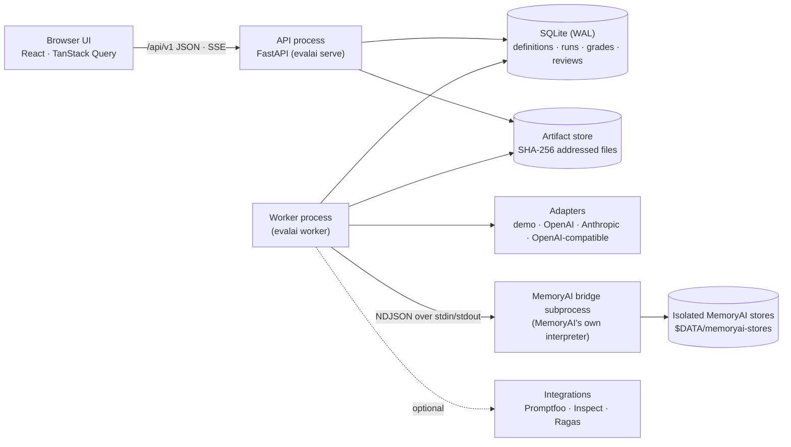

# Architecture

Eval Triage is a single-user local application: a FastAPI service, a separate
worker process, a SQLite database in WAL mode and a content-addressed artifact
store, with a React UI served by the same API process. Everything binds to
loopback.

`evalai start` runs the API and one worker together; `make dev` adds the Vite
dev server with hot reload.

## Repository layout

| Path | Contents |
|---|---|
| `backend/eval_triage/api/` | App factory, envelopes and errors, one router per area (`routes/`) |
| `backend/eval_triage/db/` | Engine (read/write engines), ORM models, Alembic migrations, immutability guard |
| `backend/eval_triage/domain/` | Scenario/dataset/episode contracts, packs and checks, importers, splits, canonical hashing |
| `backend/eval_triage/execution/` | Run validation and creation, job queue, trial runner, grading, finalisation, events, background jobs |
| `backend/eval_triage/adapters/` | Target adapters and the MemoryAI bridge client |
| `backend/eval_triage/graders/` | Deterministic checks, model and pairwise judges, pass-rule aggregation |
| `backend/eval_triage/statistics/` | Metric registry and every formula (intervals, agreement, calibration, bootstrap, gates) |
| `backend/eval_triage/analysis/` | Run summaries, triage queue, comparisons, probability quality |
| `backend/eval_triage/artifacts/` | Artifact store, redacting writers, project export/import |
| `backend/eval_triage/integrations/` | Plugin interface, Promptfoo/Inspect importers and runners, Ragas grader |
| `backend/eval_triage/testing/` | The isolated e2e server and the performance check |
| `bridges/memoryai/evalai_bridge/` | The bridge process, run with MemoryAI's interpreter (real and fake backends) |
| `frontend/` | React + TypeScript UI (`src/`), Vitest unit tests, Playwright journeys (`e2e/`) |
| `fixtures/` | Scenario packs, MemoryAI episodes M01–M15, the labelled demo, integration samples |
| `tests/` | pytest unit and integration suites |

## Data layer

* **SQLite in WAL mode** with `foreign_keys=ON`, `busy_timeout=5000` and
  `synchronous=NORMAL`. Writes go through a dedicated engine that opens every
  transaction with `BEGIN IMMEDIATE`; reads (including SSE polling) use a
  separate engine. No transaction is held across a provider call.
* **Immutability.** Definitions (scenario, dataset, case, target config, grader,
  release policy and calibration versions), grades, trial outcomes, reviews,
  comparisons, probability records, events, artifacts and imported external
  results can never be updated or deleted: SQLite triggers abort the statement
  and an ORM `before_flush` guard explains why. Trials and attempts are mutable
  only until they reach a terminal status. Runs cannot be deleted.
* **Versioning.** Versioned entities share a `logical_id` and carry a
  `version`; "edit" always creates a new version, and saving identical content
  returns the existing one.
* **Hashing.** Canonical UTF-8 JSON (sorted keys, NaN/Inf rejected) excluding
  operational keys (ids, timestamps, project id). Hashes therefore survive
  export and import into another project.
* **Artifacts.** Raw requests and responses, outputs, state snapshots and
  original import files are stored once under their SHA-256 (write to a temp
  file, hash, atomic rename) and linked through `artifact_refs`. Values that
  look like secrets are redacted before storage. Orphans are reported, never
  deleted automatically.

## Execution

1. **Validation** (`POST /runs/validate`) resolves every candidate
   configuration, checks each requested parameter against the model's
   capabilities (unsupported → error; unknown → needs a probe or experimental
   mode), checks MemoryAI prerequisites and limits, and returns the plan and
   the manifest that would be recorded. Nothing is enqueued.
2. **Creation** (`POST /runs`, with an `Idempotency-Key`) writes the run, its
   manifest (definition hashes, SDK and lockfile hashes, runtime, requested
   models, schedule seed, capability snapshot, warnings) and every trial slot
   in one transaction. A repeated key with the same body returns the same run;
   a different body is a 409.
3. **The job queue** is a table. Workers claim jobs with a lease
   (`UPDATE … RETURNING` semantics inside `BEGIN IMMEDIATE`), renew it with a
   heartbeat, and requeue jobs whose lease expired. Per-target concurrency
   limits (MemoryAI 1, stateless 2 by default) are enforced at claim time. The
   execution order is a deterministic shuffle of (case, candidate, repeat).
4. **Trials** record every attempt. Transport errors are retried at most twice
   and only for non-mutating calls. A timeout during a mutating MemoryAI action
   makes the episode *indeterminate*; an interrupted episode restarts in a
   fresh isolated store rather than replaying a mutation blindly.
5. **Grading** is a separate job per trial. Regrading creates a new grading run
   over stored outputs only — no target calls.
6. **Finalisation** re-checks the run after each job; a run whose trials all
   finished becomes `completed` or `completed_with_errors`. Cancelled runs stay
   visible and can never be marked ready.
7. **Events** are persisted rows with an increasing sequence; the SSE endpoint
   streams them and resumes from `Last-Event-ID`.

## Grading and outcomes

Each dataset declares a pass rule naming its mandatory graders. A trial
**fails** if any applicable mandatory grader fails, **passes** only if every
applicable mandatory grader passes, and is otherwise **unresolved** (grading
errors, abstentions, missing evidence). Optional graders are reported but can
neither veto nor satisfy a pass. Human reviews are appended (optionally
superseding the previous review) and never overwrite machine grades; the
adjudicated view combines both with provenance.

## Analysis

Quality, repeatability, probability quality and operations are computed and
shown separately (see [metrics.md](./metrics.md)). Every number travels as a
`MetricValue` with its definition version, counts, eligibility, uncertainty
method and contributing trial ids, and the UI renders all numbers through one
component that links to that evidence.

## Security model

* Binds to loopback by default; a `TrustedHostMiddleware` rejects other Host
  headers; non-loopback binding needs `EVAL_TRIAGE_ALLOW_NON_LOOPBACK=true`
  because there is no authentication.
* A strict Content-Security-Policy (`script-src 'self'`, no framing, no
  objects). Model output is shown as text or sanitised Markdown without raw
  HTML or images.
* Credentials are environment-variable *names*; values are read at call time
  and never stored, returned, exported or logged. Integration tests plant a
  sentinel secret and assert it never appears in responses, exports,
  artifacts or logs; the browser journeys assert the same for every request
  and response.
* Imports (project archives and external result files) are validated before
  anything is written: size and member caps, no path traversal, symlinks or
  code payloads, strict JSON, checksums. Imported URLs are never contacted.

## Frontend

React 19 with TypeScript and Vite. TanStack Query owns server state; the URL
owns filters and selections so evidence can be bookmarked. Route pages are
code-split (the initial bundle is ~260 kB; the charting library loads only
with the Probability Lab). Shared components implement the required states
(loading, empty, partial, error with retry, disconnected, unavailable) and
the single `MetricValue` renderer.
